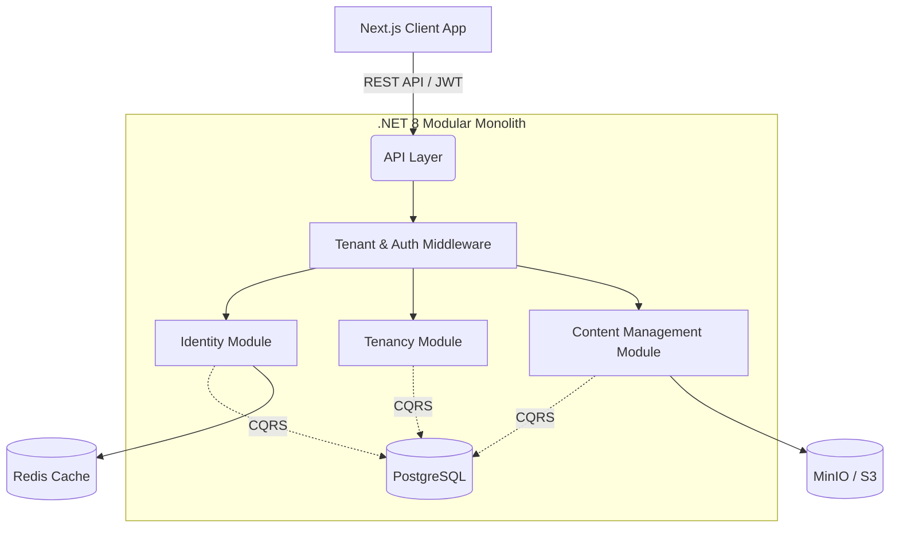

# AIG LMS

> An enterprise-grade, multi-tenant Learning Management System designed to serve multiple schools under independent workspaces while maintaining a unified infrastructure.

## Overview
AIG LMS is a production-ready B2B E-Learning platform built to solve the complex problem of multi-tenancy in education. It allows a single platform deployment to host multiple tenants, where each tenant can manage one or multiple schools with strict data isolation. 

Built with a Modular Monolith architecture on .NET 8 and a Next.js frontend, the system prioritizes scalability, security, and operational efficiency for enterprise clients.

---

## Key Features

### Multi-Tenancy & Workspace Management
* **Flexible Tenant Hierarchy**: Supports one-to-one (one tenant = one school) and one-to-many (one tenant = multiple schools) relationships.
* **Smart Tenant Resolution**: Resolves active tenant context via wildcard subdomains (e.g., `stem.domain.com`) or fallback JWT claims for single-domain deployments.
* **Tenant Isolation**: Strictly isolates tenant data at the database layer using scoped contexts.

### Advanced Authentication & Authorization
* **Robust JWT & Refresh Tokens**: Secure authentication flow with hashed refresh tokens stored in the database.
* **Concurrent Session Control**: Configurable session policies per school (e.g., Block New Login, or Kick Oldest Session when limits are reached).
* **Brute-Force Protection**: Automatic account lockout after a configured number of failed login attempts, with email alerts to system administrators.
* **Granular RBAC**: Complex role hierarchy including `SUPER_ADMIN`, `LMS_ADMIN`, `TENANT_ADMIN`, `SCHOOL` admins, `TEACHER`, `STUDENT`, and `CLIENT`.

### Infrastructure & Operations
* **Cloud Storage**: Integrated with MinIO/AWS S3 for scalable content and media management.
* **Audit Logging**: Comprehensive tracking of critical actions (login attempts, session revocations, etc.) for security compliance.

---

## Architecture

AIG LMS follows a **Modular Monolith** architecture with **CQRS** principles, ensuring high cohesion within business domains and loose coupling between them.



### Key Architectural Decisions
* **Modular Monolith over Microservices**: Selected to reduce operational overhead for the current team size while maintaining clear module boundaries for future extraction if scale demands.
* **Dapper for Data Access**: Chosen over heavier ORMs for critical read-paths to ensure maximum performance and control over complex multi-tenant SQL queries.

---

## Tech Stack

| Layer | Technology | Purpose |
| --- | --- | --- |
| **Frontend** | Next.js, React, Redux, MUI | Server-Side Rendering (SSR) & robust UI components. |
| **Backend** | .NET 8, C#, ASP.NET Core | High-performance API API & business logic execution. |
| **Database** | PostgreSQL | Relational data persistence with tenant-isolated queries. |
| **Cache** | Redis | High-speed caching for performance optimization. |
| **Storage** | MinIO / AWS S3 | S3-compatible object storage for media and documents. |
| **Patterns** | CQRS, Repository Pattern | Clean separation of read/write operations and data access. |

---

## My Contributions

As the **Backend Lead** over the 6-month development lifecycle, I was responsible for the end-to-end technical delivery of the system. 

* **Designed the System Architecture**: Architected the Modular Monolith structure and multi-tenant database schema to ensure strict data isolation without duplicating infrastructure.
* **Developed the Identity & Tenancy Modules**: Engineered the secure authentication flow, JWT token generation, and the smart middleware that resolves tenant contexts based on subdomains or token claims.
* **Implemented Session Management**: Built complex concurrent session policies (Block New / Kick Oldest) and brute-force protection mechanisms.
* **Database Optimization**: Wrote high-performance SQL queries using Dapper for critical data access paths.
* **Integrated Cloud Storage**: Implemented the `ContentManagement` module connecting to MinIO/S3 for robust file handling.

---

## Database Design

The database schema is optimized for multi-tenancy. Key design decisions include:

* Every business entity contains `tenant_id` and `school_id` foreign keys.
* `user_tenant_role_assignment` table handles the complex many-to-many relationship mapping Users to Roles within specific Tenants.
* Soft-delete (`is_deleted = TRUE`) is implemented across all critical tables to prevent accidental data loss.

---

## Security

* **Authentication**: JWT-based with secure Refresh Token rotation.
* **Authorization**: Role-Based Access Control (RBAC) enforced at the API endpoint level.
* **Tenant Isolation**: `TenantResolutionMiddleware` intercepts all requests, extracting the tenant context from the Domain or JWT and strictly scoping database queries to prevent data leakage.
* **Rate Limiting & Lockouts**: Temporary account lockouts applied automatically after consecutive failed logins.

---

## Testing

* **Unit Tests**: Core business logic and CQRS handlers (e.g., `LoginCommandHandlerTests`) are tested using xUnit and NSubstitute.

---

## Challenges & Solutions

### 1. Multi-Tenant Routing on Single-Domain Cloud Platforms
**Challenge:** 
The platform was architected to route users to specific tenants via wildcard subdomains (e.g., `stem.domain.com`). However, deploying the frontend on Vercel's Free Tier (`.vercel.app`) presented a critical blocker, as wildcard subdomains are not supported without a custom domain, causing continuous 404 routing errors.

**Investigation:** 
I traced the routing logic in the Next.js `GuestGuard` and `AuthGuard` components, observing that they were forcing a domain rewrite based on the user's assigned tenant subdomain.

**Solution:** 
I modified the frontend routing layer to detect the deployment environment. If a generic `.vercel.app` domain is detected, the frontend bypasses the subdomain rewrite. Concurrently, I leveraged my backend's `TenantResolutionMiddleware`, which was inherently designed with a priority system: it reads the `tenant_id` directly from the JWT claims *before* falling back to the Host header.

**Result:** 
The application now runs flawlessly on a single generic domain for testing/staging environments, while seamlessly preserving the robust wildcard subdomain architecture for production deployments with custom domains.

### 2. Enforcing Strict Concurrent Session Policies
**Challenge:** 
Schools required the ability to limit concurrent logins (e.g., preventing students from sharing accounts) but demanded different strategies—some wanted to block the second login attempt, while others wanted to kick the oldest active session.

**Solution:** 
I designed a comprehensive `user_session` tracking system and integrated it into the `LoginCommandHandler`. Before issuing a new JWT, the system queries the active session count for the specific user. Depending on the `school_tenant_mapping` policy configuration, the system uses Dapper to either safely revoke the oldest session (`status = 'REVOKED'`) or throws a custom `CONCURRENT_SESSION_LIMIT` error to block the current attempt.

**Result:** 
Achieved complete control over account sharing, improving platform security and strictly enforcing software licensing limits for participating schools.

---

## Project Structure

```text
LMS-Source-3/
├── e-learning.backend/
│   ├── src/
│   │   ├── Api/                    # API Gateway & configurations
│   │   ├── BuildingBlocks/         # Shared utilities (Storage, Email)
│   │   ├── Modules/                # Independent business domains 
│   │   └── Workers/                # Background processing services
│   ├── database/                   # SQL Migration scripts
│   └── tests/                      # Unit tests
└── e-learning.web/                 # Next.js Frontend application
```

---

## Getting Started

### Prerequisites
* .NET 8 SDK
* Node.js (v18+)
* PostgreSQL
* Redis
* MinIO or AWS S3

### Installation

1. **Clone the repository**
   ```bash
   git clone <repository-url>
   ```

2. **Backend Setup**
   ```bash
   cd e-learning.backend
   dotnet restore
   dotnet build
   ```
   * Configure `appsettings.json` with your Database, Redis, and MinIO connection strings.
   * Run Database migrations.
   ```bash
   dotnet run --project src/Api/Aig.Lms.Api
   ```

3. **Frontend Setup**
   ```bash
   cd e-learning.web
   npm install
   npm run dev
   ```

---

## API Documentation

**API Documentation (Scalar):** [https://dev-api.daihoc.io.vn/scalar/](https://dev-api.daihoc.io.vn/scalar/)

---

## Deployment & Demo

**Frontend Demo:** [https://lms-fawn-phi.vercel.app](https://lms-fawn-phi.vercel.app)

**Test Accounts:**
*(Password for all accounts: `Admin@123`)*
* Super Admin: `superadmin`
* School Admin: `stem_admin`
* Teacher: `Teacher001`
