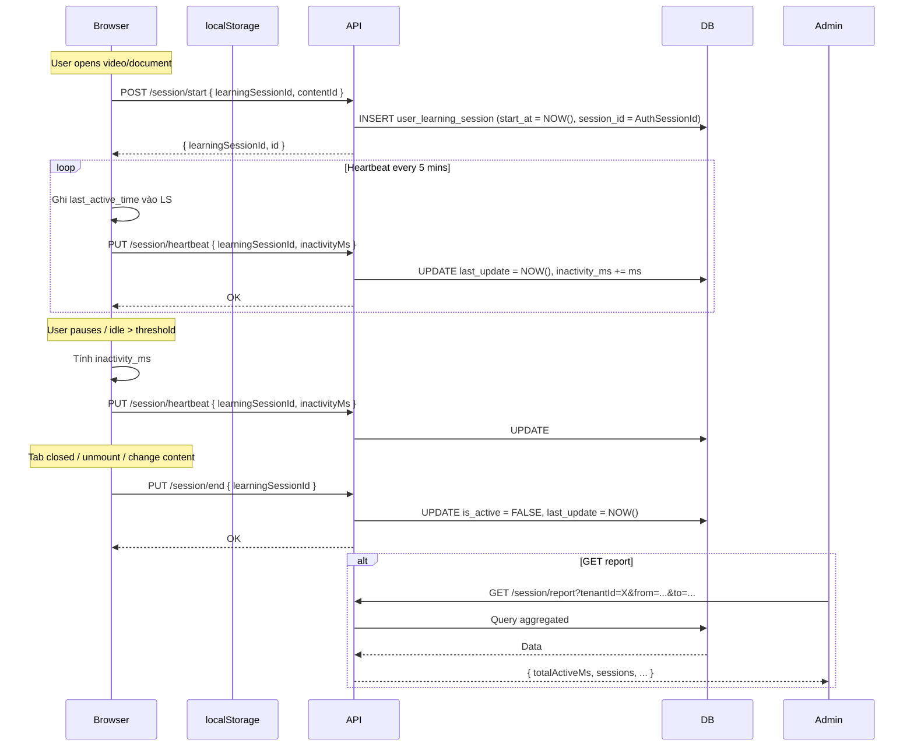

# Kế hoạch phát triển tính năng: Theo dõi thời gian học theo Session

**Ngày:** 2026-07-13  
**Phiên bản:** 1.0

---

## 1. Mục tiêu

Xây dựng hệ thống ghi nhận thời gian học thực tế của người dùng dựa trên **phiên làm việc (session)**, thay vì chỉ dựa vào `progress_value` (số giây đã xem) như hiện tại.

Cho phép:
- Tính tổng thời gian học chính xác theo từng phiên.
- Phân tích thời gian học theo **user**, **school**, **tenant**, **content**.
- Phát hiện thời gian chết (inactivity) để loại bỏ nhiễu.

---

## 2. Lý do & Bối cảnh

### 2.1 Vấn đề hiện tại

- Hệ thống hiện tại chưa có cơ chế ghi nhận thời gian học thực tế của người dùng.
- Không thể phân biệt giữa "xem chăm chỉ" và "mở tab rồi bỏ đó".

### 2.2 Đặc thù domain

> **1 School = 1 User.**  
> Mỗi school có 1 tài khoản user đại diện. Cùng lúc có thể có nhiều session từ nhiều user khác nhau xem nội dung.  
> → Cần tracking theo **session** để capture được toàn bộ thời gian học của tất cả user đồng thời.

---

## 3. Thiết kế Database

### 3.1 Bảng `user_learning_session`

```sql
CREATE TABLE IF NOT EXISTS user_learning_session (
    id                  UUID          PRIMARY KEY DEFAULT gen_random_uuid(),
    learning_session_id UUID          NOT NULL,        -- Client-generated UUID cho mỗi lần xem content
    session_id          UUID          NOT NULL,        -- Auth session ID của người dùng (từ token/cookie)
    user_id             UUID          NOT NULL REFERENCES user_account(id) ON DELETE CASCADE,
    school_id           UUID          REFERENCES school(id) ON DELETE SET NULL,
    tenant_id           UUID          NOT NULL REFERENCES tenant(id) ON DELETE CASCADE,
    content_item_id     UUID          REFERENCES content_item(id) ON DELETE SET NULL,
    start_at            TIMESTAMPTZ   NOT NULL DEFAULT NOW(),
    last_update         TIMESTAMPTZ   NOT NULL DEFAULT NOW(),
    inactivity_ms       BIGINT        NOT NULL DEFAULT 0,  -- Tổng thời gian inactivity (ms)
    device_info         JSONB,                            -- UA, platform, etc.
    ip_address          INET,
    is_deleted          BOOLEAN       NOT NULL DEFAULT FALSE,
    created_at          TIMESTAMPTZ   NOT NULL DEFAULT NOW(),
    created_by          UUID          REFERENCES user_account(id) ON DELETE SET NULL,
    updated_at          TIMESTAMPTZ   NOT NULL DEFAULT NOW(),
    updated_by          UUID          REFERENCES user_account(id) ON DELETE SET NULL
);

-- Indexes
CREATE UNIQUE INDEX IF NOT EXISTS uq_uls_learning_session_id
    ON user_learning_session (learning_session_id);

CREATE INDEX idx_uls_user_tenant
    ON user_learning_session (tenant_id, user_id)
    WHERE is_deleted = FALSE;

CREATE INDEX idx_uls_learning_session_lookup
    ON user_learning_session (learning_session_id)
    WHERE is_deleted = FALSE;

CREATE INDEX idx_uls_auth_session_lookup
    ON user_learning_session (session_id)
    WHERE is_deleted = FALSE;

CREATE INDEX idx_uls_content
    ON user_learning_session (content_item_id)
    WHERE is_deleted = FALSE;

CREATE INDEX idx_uls_time_range
    ON user_learning_session (tenant_id, start_at, last_update)
    WHERE is_deleted = FALSE;

CREATE INDEX idx_uls_school
    ON user_learning_session (school_id)
    WHERE is_deleted = FALSE;
```

### 3.2 View tổng hợp thời gian học

```sql
CREATE OR REPLACE VIEW v_user_learning_time AS
SELECT
    tenant_id,
    user_id,
    school_id,
    content_item_id,
    COUNT(*)                                                      AS session_count,
    SUM(EXTRACT(EPOCH FROM (last_update - start_at)) * 1000)      AS total_session_ms,
    COALESCE(SUM(inactivity_ms), 0)                               AS total_inactivity_ms,
    SUM(EXTRACT(EPOCH FROM (last_update - start_at)) * 1000)
        - COALESCE(SUM(inactivity_ms), 0)                         AS active_learning_ms
FROM user_learning_session
WHERE is_deleted = FALSE
GROUP BY tenant_id, user_id, school_id, content_item_id;
```

---

## 4. Luồng hoạt động



---

## 5. Kế hoạch sửa đổi chi tiết

### 5.1 Migration Database

**File mới:** `database/V18__user_learning_session.sql`

- Tạo bảng `user_learning_session` như mục 3.1.
- Tạo view `v_user_learning_time` như mục 3.2.

### 5.2 Backend — API Endpoints

| Method | Endpoint | Mô tả |
|--------|----------|-------|
| `POST` | `/api/content/session/start` | Tạo session mới |
| `PUT`  | `/api/content/session/heartbeat` | Cập nhật last_update + inactivity |
| `PUT`  | `/api/content/session/end` | Kết thúc session |
| `GET`  | `/api/content/session/report` | Lấy báo cáo tổng hợp (admin) |

#### 5.2.1 Request / Response

**POST /session/start**
```json
// Request
{
  "learningSessionId": "uuid",
  "contentItemId": "uuid",
  "deviceInfo": { "userAgent": "...", "platform": "web" }
}
// Response 201
{
  "id": "uuid",
  "learningSessionId": "uuid",
  "sessionId": "uuid",
  "startAt": "2026-07-13T10:00:00Z"
}
```

**PUT /session/heartbeat**
```json
// Request
{
  "learningSessionId": "uuid",
  "inactivityMs": 5000
}
// Response 200
{
  "updatedAt": "2026-07-13T10:05:00Z"
}
```

**PUT /session/end**
```json
// Request
{
  "learningSessionId": "uuid"
}
// Response 200
{
  "learningSessionId": "uuid",
  "totalMs": 300000,
  "inactivityMs": 15000,
  "activeMs": 285000
}
```

#### 5.2.2 Repository Interface

**File mới:** `src/Modules/ContentManagement/Aig.Lms.Modules.ContentManagement.Application/Session/ILearningSessionRepository.cs`

```csharp
public interface ILearningSessionRepository
{
    Task<LearningSessionDto> StartSessionAsync(StartSessionCommand command, CancellationToken ct);
    Task UpdateHeartbeatAsync(HeartbeatCommand command, CancellationToken ct);
    Task<SessionSummaryDto> EndSessionAsync(EndSessionCommand command, CancellationToken ct);
    Task<List<SessionReportDto>> GetReportAsync(SessionReportQuery query, CancellationToken ct);
}
```

### 5.3 Frontend — Session Manager

**File mới:** `src/hooks/useLearningSession.ts`

```typescript
// Hook quản lý vòng đời session
function useLearningSession(contentId: string) {
  const [learningSessionId, setLearningSessionId] = useState<string | null>(null);
  const lastActiveRef = useRef<number>(Date.now());
  const inactivityAccumRef = useRef<number>(0);

  // 1. Quản lý vòng đời session khi thay đổi contentId
  useEffect(() => {
    if (!contentId) return;

    const lsid = uuidv4();
    setLearningSessionId(lsid);
    lastActiveRef.current = Date.now();
    inactivityAccumRef.current = 0;

    // Khởi tạo session mới trên server (Auth session ID sẽ được backend tự lấy từ token)
    axios.post(API_ENDPOINTS.sessionStart, {
      learningSessionId: lsid,
      contentItemId: contentId,
      deviceInfo: { userAgent: navigator.userAgent, platform: 'web' }
    });

    // Cleanup function: Chạy khi unmount HOẶC khi contentId thay đổi
    return () => {
      const now = Date.now();
      const idle = now - lastActiveRef.current;
      const finalInactivity = inactivityAccumRef.current + (idle > 60000 ? idle : 0);

      // Gửi request kết thúc session cũ ngay lập tức
      axios.put(API_ENDPOINTS.sessionEnd, { 
        learningSessionId: lsid,
        inactivityMs: finalInactivity
      }).catch(err => {
        // Fallback sang sendBeacon nếu axios thất bại do chuyển trang nhanh
        const payload = JSON.stringify({ learningSessionId: lsid, inactivityMs: finalInactivity });
        navigator.sendBeacon('/api/content/session/end', payload);
      });
    };
  }, [contentId]);

  // 2. Heartbeat interval 5 phút (Giảm tải server, chỉ để backup phòng khi crash)
  useEffect(() => {
    if (!learningSessionId) return;
    const interval = setInterval(() => {
      const now = Date.now();
      const idle = now - lastActiveRef.current;
      if (idle > 60000) {
        inactivityAccumRef.current += idle;
      }
      axios.put(API_ENDPOINTS.sessionHeartbeat, {
        learningSessionId,
        inactivityMs: inactivityAccumRef.current
      });
      inactivityAccumRef.current = 0;
      lastActiveRef.current = now;
    }, 300000); // 5 phút
    return () => clearInterval(interval);
  }, [learningSessionId]);

  // 3. Track user activity & Page Exit (Đảm bảo độ tin cậy khi thoát trang)
  useEffect(() => {
    const update = () => { lastActiveRef.current = Date.now(); };
    window.addEventListener('mousemove', update);
    window.addEventListener('keydown', update);
    window.addEventListener('scroll', update);
    window.addEventListener('touchstart', update);
    
    const handleExit = () => {
      if (!learningSessionId) return;
      const now = Date.now();
      const idle = now - lastActiveRef.current;
      const finalInactivity = inactivityAccumRef.current + (idle > 60000 ? idle : 0);
      
      const payload = JSON.stringify({
        learningSessionId,
        inactivityMs: finalInactivity,
        isFinal: true
      });
      
      // Sử dụng fetch keepalive thay cho sendBeacon để hỗ trợ PUT và Custom Headers (Token)
      fetch('/api/content/session/end', {
        method: 'PUT',
        headers: {
          'Content-Type': 'application/json',
          // 'Authorization': `Bearer ${token}` -- Thêm token nếu cần
        },
        body: payload,
        keepalive: true
      });
    };

    // visibilitychange đáng tin cậy hơn beforeunload trên thiết bị di động
    const handleVisibilityChange = () => {
      if (document.visibilityState === 'hidden') {
        handleExit();
      }
    };

    window.addEventListener('beforeunload', handleExit);
    document.addEventListener('visibilitychange', handleVisibilityChange);

    return () => {
      window.removeEventListener('mousemove', update);
      window.removeEventListener('keydown', update);
      window.removeEventListener('scroll', update);
      window.removeEventListener('touchstart', update);
      window.removeEventListener('beforeunload', handleExit);
      document.removeEventListener('visibilitychange', handleVisibilityChange);
    };
  }, [learningSessionId]);

  return { learningSessionId };
}
```
```

#### 5.3.1 Tích hợp vào `[id].tsx`

- Gọi `useLearningSession(id)` khi component mount.
- Không cần thay đổi logic progress cũ — 2 tính năng chạy song song.

### 5.4 Tích hợp

Tính năng này hoạt động độc lập, tập trung hoàn toàn vào việc đo lường thời gian học thực tế của người dùng.

---

## 6. Công thức tính thời gian học

```
Active Learning Time = Σ(last_update - start_at) - Σ(inactivity_ms)
```

| Biến số | Ý nghĩa |
|---------|---------|
| `last_update - start_at` | Tổng thời gian từ lúc bắt đầu session đến lần cuối heartbeat |
| `inactivity_ms` | Thời gian không có tương tác (mouse/keyboard/touch) |
| **Active Learning Time** | Thời gian học thực tế, đã loại trừ inactivity |

**Ngưỡng inactivity mặc định:** 60 giây không có tương tác → bắt đầu tính inactivity.

---

## 7. Tối ưu cho 10K user (Giảm tải & Tránh Stress Server)

### 7.1 Chiến lược giảm tải từ Client (Frontend-driven Optimization)

Để tránh việc 10.000 user đồng thời gửi heartbeat liên tục làm nghẽn API Gateway và quá tải CPU server, chúng ta chuyển phần lớn việc tính toán thời gian học và inactivity sang phía Client:

1. **Không gửi Heartbeat định kỳ lên Server:**
   - Client tự theo dõi thời gian học (`active_duration`) và thời gian chết (`inactivity_duration`) cục bộ bằng `localStorage` hoặc bộ nhớ RAM.
   - Chỉ gửi dữ liệu lên server tại các thời điểm quan trọng (Trigger-based):
     - **Pause/Stop:** Khi người dùng tạm dừng video hoặc chuyển tab.
     - **Unmount/Close:** Khi người dùng đóng trang hoặc tắt trình duyệt (sử dụng `navigator.sendBeacon` hoặc `fetch` với `keepalive: true` để đảm bảo request thành công mà không block UI).
     - **Định kỳ dài (Long Heartbeat):** Tăng khoảng thời gian gửi định kỳ từ 30 giây lên **5-10 phút** (chỉ để phòng ngừa trường hợp crash máy tính đột ngột).

2. **Sử dụng `navigator.sendBeacon` khi đóng tab:**
   - Khi người dùng đóng tab hoặc tắt trình duyệt, các request HTTP thông thường (`axios.put`) có thể bị hủy.
   - Sử dụng `navigator.sendBeacon('/api/content/session/end', data)` để trình duyệt tự động gửi dữ liệu dưới nền một cách bất đồng bộ mà không gây tải cho luồng chính của client và đảm bảo server nhận được dữ liệu cuối cùng.

### 7.2 Tối ưu hóa xử lý ở Backend (Server-side)

1. **API Gateway Rate Limiting:**
   - Giới hạn tần suất request `/session/heartbeat` tối đa 1 request / 5 phút cho mỗi session.
   - Trả về `429 Too Many Requests` ngay lập tức nếu client vi phạm, tránh xử lý sâu vào logic nghiệp vụ.

2. **Sử dụng Redis làm Buffer (Write-Behind Caching):**
   - Khi nhận request cập nhật session, API chỉ ghi đè dữ liệu mới nhất vào Redis (tốc độ ghi cực nhanh, < 1ms).
   - Một Worker Service chạy ngầm sẽ quét Redis định kỳ (ví dụ: mỗi 10 giây) và thực hiện ghi hàng loạt (Bulk Write) xuống PostgreSQL.
   - **Lợi ích:** Giảm số lượng truy vấn ghi vào DB từ 10.000 req/s xuống còn vài chục truy vấn bulk write/s.

### 7.3 Khác biệt so với các tính năng khác

| Điểm | `user_learning_session` |
|------|------------------------|
| Tần suất ghi | Cao (heartbeat 5 phút) |
| Kích thước DB | Nhiều rows / user / content |
| Batch strategy | INSERT + UPDATE batch riêng |
| Retention | Có thể archive sau 90 ngày |

### 7.3 Batch INSERT cho heartbeat

```sql
INSERT INTO user_learning_session (
    id, learning_session_id, session_id, user_id, school_id, tenant_id, content_item_id,
    start_at, last_update, inactivity_ms, is_active, device_info, ip_address
)
VALUES
    (@Id1, @LSid1, @AuthSid1, ...),
    (@Id2, @LSid2, @AuthSid2, ...)
ON CONFLICT (id) DO NOTHING;

-- Hoặc dùng UNLOGGED table nếu không cần WAL recovery cho heartbeat
```

### 7.4 Retention Policy

```sql
-- Archive sessions > 90 ngày
CREATE TABLE user_learning_session_archive (LIKE user_learning_session INCLUDING ALL);
ALTER TABLE user_learning_session_archive ADD COLUMN archived_at TIMESTAMPTZ DEFAULT NOW();

-- Job định kỳ
DELETE FROM user_learning_session
WHERE is_deleted = FALSE
  AND is_active = FALSE
  AND last_update < NOW() - INTERVAL '90 days';
```

---

## 8. Phân công công việc

| Hạng mục | Mô tả | Ưu tiên |
|----------|-------|---------|
| **P1** | Tạo migration V18 (bảng + indexes + view) | Cao |
| **P1** | Backend: Repository + 3 API endpoints (start/heartbeat/end) | Cao |
| **P1** | Frontend: Hook `useLearningSession` | Cao |
| **P2** | Backend: API report `/session/report` | Trung bình |
| **P2** | Frontend: Tích hợp `useLearningSession` vào `[id].tsx` | Trung bình |
| **P2** | Queue + Worker cho session heartbeat | Trung bình |
| **P3** | Retention policy + archive | Thấp |
| **P3** | Dashboard hiển thị thời gian học | Thấp |

---

## 9. Rollout Plan

1. **Phase 1:** Migration DB + Backend API cơ bản (sync, chưa queue).
2. **Phase 2:** Frontend hook `useLearningSession` + tích hợp vào video viewer.
3. **Phase 3:** Queue + Worker cho heartbeat (tối ưu 10K user).
4. **Phase 4:** Report API + Dashboard + Archive.

---

## 10. Metrics & Monitoring

| Metric | Mục tiêu | Công cụ |
|--------|----------|---------|
| Session write throughput | > 5000 events/s | Prometheus |
| P95 latency (heartbeat) | < 100ms | Grafana |
| Active sessions (concurrent) | < 50000 | Redis counter |
| Session retention compliance | 90 ngày | pg_cron |
