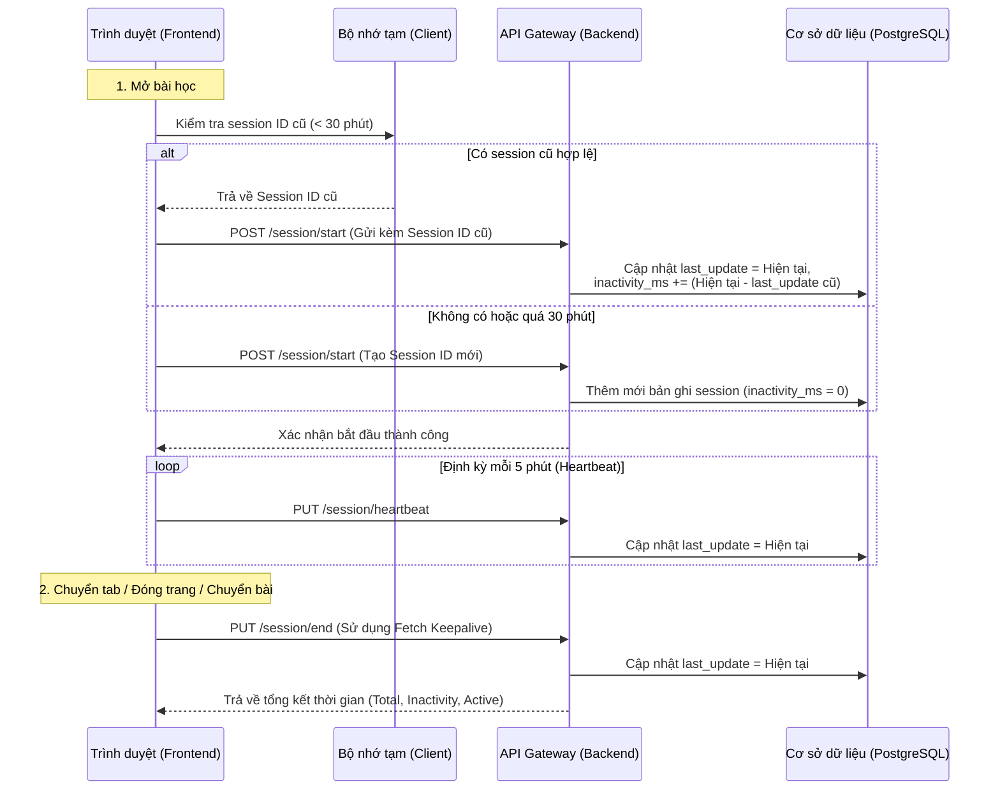

# Tài liệu Đặc tả Hệ thống Theo dõi Thời gian Học theo Session

Tài liệu này mô tả luồng hoạt động, cơ chế tính toán và thông tin các API của tính năng theo dõi thời gian học thực tế của người dùng dựa trên phiên làm việc (session).

---

## 1. Nguyên lý hoạt động & Cơ chế tính toán

Hệ thống đo lường thời gian học thực tế (**Active Learning Time**) bằng cách lấy tổng thời gian của phiên trừ đi thời gian không hoạt động (**Inactivity Time**).

### 1.1 Công thức tính
$$\text{Active Learning Time} = (\text{last\_update} - \text{start\_at}) - \text{inactivity\_ms}$$

*   **start_at**: Thời điểm bắt đầu phiên học (lần đầu tiên mở bài học).
*   **last_update**: Thời điểm cuối cùng hệ thống ghi nhận người dùng còn tương tác hoặc gửi tín hiệu (heartbeat/end).
*   **inactivity_ms**: Tổng thời gian người dùng rời khỏi bài học (chuyển tab, đóng trình duyệt, chuyển trang) nhưng sau đó quay lại học tiếp trong giới hạn cho phép.

### 1.2 Cơ chế tính Inactivity (Thời gian đi vắng)
*   Khi người dùng chuyển tab hoặc đóng trang, hệ thống sẽ gửi tín hiệu kết thúc tạm thời (`end`) để cập nhật `last_update`.
*   Nếu người dùng quay lại học tiếp bài học đó trong vòng **30 phút**:
    *   Hệ thống sẽ khôi phục (resume) lại session cũ thay vì tạo mới.
    *   Khoảng thời gian đi vắng (từ lúc `last_update` cũ đến lúc quay lại `start` mới) sẽ được tính là **Inactivity Time** và cộng dồn vào `inactivity_ms`.
*   Nếu người dùng quay lại sau **30 phút**, hệ thống sẽ coi như một phiên học mới hoàn toàn.

---

## 2. Luồng hoạt động (Sequence Flow)



---

## 3. Công nghệ sử dụng (Tech Stack)

*   **Frontend**:
    *   **Next.js / React**: Quản lý trạng thái giao diện và vòng đời component bài học.
    *   **Fetch API (Keepalive)**: Đảm bảo request kết thúc session (`end`) luôn được gửi thành công lên server ngay cả khi người dùng đóng tab hoặc tắt trình duyệt đột ngột.
    *   **LocalStorage**: Lưu trữ tạm thời Session ID và mốc thời gian hoạt động cuối cùng của từng bài học để phục vụ cơ chế resume.
*   **Backend**:
    *   **.NET Core (Minimal APIs)**: Xử lý các endpoint API gọn nhẹ, hiệu năng cao.
    *   **Dapper**: Thực thi các câu lệnh SQL thuần túy tối ưu tốc độ đọc/ghi.
    *   **PostgreSQL**: Lưu trữ dữ liệu phiên học (`user_learning_session`) và cung cấp View tổng hợp dữ liệu thời gian học (`v_user_learning_time`).

---

## 4. Danh sách APIs

Tất cả các API yêu cầu đính kèm Token xác thực (`Authorization: Bearer <token>`) trong Header.

### 4.1 Bắt đầu / Khôi phục phiên học
*   **Endpoint**: `POST /api/content/session/start`
*   **Mô tả**: Khởi tạo một phiên học mới hoặc khôi phục phiên cũ nếu người dùng quay lại trong vòng 30 phút.
*   **Request Body**:
    ```json
    {
      "learningSessionId": "uuid",
      "contentItemId": "uuid",
      "deviceInfo": {
        "userAgent": "Mozilla/5.0...",
        "platform": "web"
      }
    }
    ```
*   **Response (201 Created)**:
    ```json
    {
      "id": "uuid",
      "learningSessionId": "uuid",
      "sessionId": "uuid",
      "startAt": "2026-07-14T07:25:49Z"
    }
    ```

### 4.2 Cập nhật định kỳ (Heartbeat)
*   **Endpoint**: `PUT /api/content/session/heartbeat`
*   **Mô tả**: Cập nhật thời gian tương tác cuối cùng của người dùng để tránh bị tính thời gian chết khi vẫn đang mở tab.
*   **Request Body**:
    ```json
    {
      "learningSessionId": "uuid"
    }
    ```
*   **Response (200 OK)**:
    ```json
    {
      "updatedAt": "2026-07-14T07:30:49Z"
    }
    ```

### 4.3 Kết thúc phiên học
*   **Endpoint**: `PUT /api/content/session/end`
*   **Mô tả**: Ghi nhận thời điểm dừng học khi người dùng chuyển tab hoặc đóng trang.
*   **Request Body**:
    ```json
    {
      "learningSessionId": "uuid"
    }
    ```
*   **Response (200 OK)**:
    ```json
    {
      "learningSessionId": "uuid",
      "totalMs": 300000,
      "inactivityMs": 60000,
      "activeMs": 240000
    }
    ```

### 4.4 Báo cáo tổng hợp thời gian học (Dành cho Admin)
*   **Endpoint**: `GET /api/content/session/report`
*   **Mô tả**: Lấy danh sách tổng hợp thời gian học thực tế phân trang, hỗ trợ lọc theo người dùng, trường học, nội dung và khoảng thời gian.
*   **Query Parameters**:
    *   `userId` (uuid, optional)
    *   `schoolId` (uuid, optional)
    *   `contentItemId` (uuid, optional)
    *   `from` (datetime, optional)
    *   `to` (datetime, optional)
    *   `page` (int, default = 1)
    *   `pageSize` (int, default = 20)
*   **Response (200 OK)**:
    ```json
    {
      "items": [
        {
          "tenantId": "uuid",
          "userId": "uuid",
          "schoolId": "uuid",
          "contentItemId": "uuid",
          "sessionCount": 5,
          "totalSessionMs": 1500000,
          "totalInactivityMs": 300000,
          "activeLearningMs": 1200000
        }
      ],
      "totalCount": 1,
      "page": 1,
      "pageSize": 20
    }
    ```
